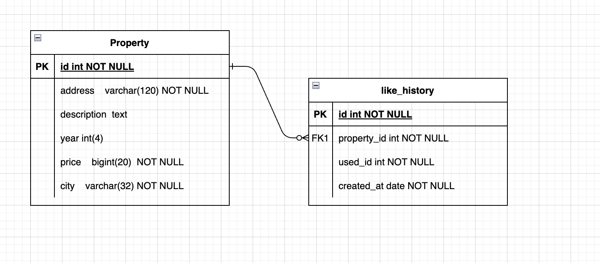
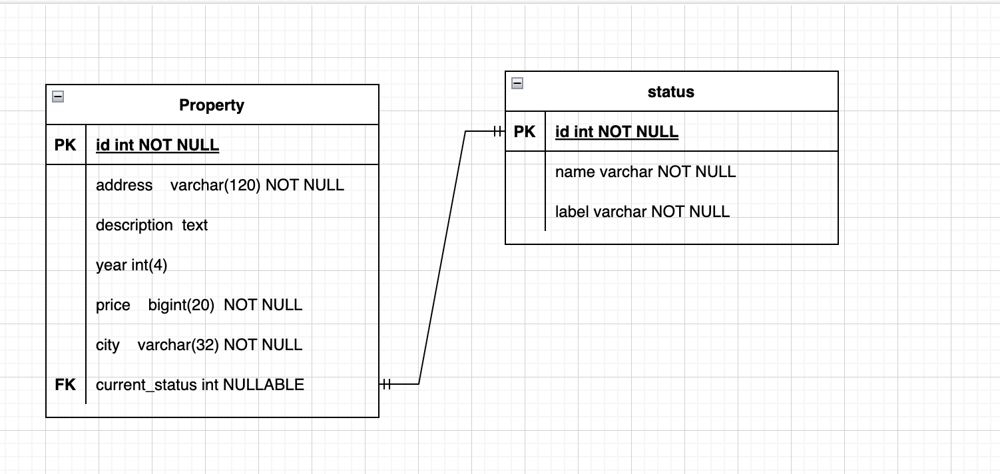

# ¿Como abordardé el proyecto?

Aplicaré patrones de desarrollo que permitan manejar los recursos eficientemente como Singleton. Además, trataré de usar una arquitectura modular que permita gestionar escalar la aplicación, haré uso de principios SOLID al aplicar la arquitectura modular, tales como inyección de dependencias e interfaces para hacer los componentes de las app reutilizables.

Las tecnologías que utilizaré son:

1. FastAPI | Reconocida por ser fácil, escalable y rápida.
2. Pydantic | Manejo de Modelos Fácil
3. MySQL Connector | Connector de MySQL
4. Pytest | Test fáciles y rápidos

Nota: En cuanto a base de datos, cree un wrapper parecido a un ORM usando Abstract Repository, sin embargo para poder demostrar mi capacidad en SQL, agregue un metodo que permite ejecutar consultas personalizadas. Personalmente prefiero el uso de ORM y Abstract Repository ya que los patrones permiten intercambiar bases de datos como si fueran plugins, pero entendiendo que se necesita ver consultas SQL creé el método anteriomente mencionado. La razón de crear los metodos del repository es para poder implementar el micro-servicio de likes; una raazón adicional por la que se implemento repostirios es para demostrar el uso de buenas prácticas y patrones de diseño

# Dudas sobre la marcha y como las resolví.

1. ¿Cómo manejar los registros dañados? <br>
   R/ Noté un patrón en los datos, dónde los que tenian el precio en 0 o nulo, siempre tenían sus datos vacíos o nulos. Así que la solución para filtrar los datos dañados es filtrar los que tengan un precio mayor a 0. Hay algunos campos nulo que son fundamentales o pueden ser efecitvamente nulos en cuanto al modelo de datos, como la descripción o el año de venta. Así que se soporta nativamente estos datos como nulos.

# Curls de prueba

1. Probar Servicio de propiedades con varios filtros

```
curl --location 'http://127.0.0.1:8000/property/list?pageSize=100&page=1&city=medellin&status=pre_venta&builtYearStart=2000' \
--header 'accept: application/json'
```

# Ejecución del servicio de Likes

Para el servicio de likes, el requerimiento indica que los likes deben quedar registrados en un historico donde se registra que usuario dio like, a que hora y a que inmueble. Por lo tanto el diagrama de entidad relación quedaría tal que así:



En cuanto al código SQL para poder soportar está tabla sería tal que así:

```
CREATE TABLE IF NOT EXISTS like_history (
   id INT NOT NULL PRIMARY KEY AUTOINCREMENT,   -- Clave primaria
   property_id INT NOT NULL,                    -- ID de la propiedad (clave foránea)
   used_id INT NOT NULL,                        -- ID del usuario (clave foránea)
   created_at DATE NOT NULL,                    -- Columna de fecha de creación
   CONSTRAINT FK_property FOREIGN KEY (property_id) REFERENCES property(id)  -- Clave foránea que referencia a property
   CONSTRAINT FK_user FOREIGN KEY (used_id) REFERENCES user(id)  -- Clave foránea que referencia a user
);
```

## Nota importante, apesar de que no está en el requerimiento, se crea una mini API de likes para demostrar el uso del patrón repository con SQLite para no afectar la bd de prueba :)

curl de prueba para servicio de likes

```
curl --location 'http://127.0.0.1:8000/like' \
--header 'Content-Type: application/json' \
--data '{
    "userId": 123,
    "propertyId": 999
}'
```

# Puntos extras.

### Mejora de la base de datos.

Para hacer más eficients las consultas y evitar subquerys, el modelo de 'property' debería incluir el id del ultimo estado en el que se encuentra, en vez de tener que recurrir al historial consultando el registro más reciente se podrá hacer un solo JOIN con la tabla que contiene la información de los estados.

Se propone que el nuevo modelo sea así:


### TTD (Tests)

Los puedes correr con el comando

```
pytest
```

Recomendaciones adicionales:

1. Usar triggers para actualizar el current_status en property.
2. Usar indices para mejorar el rendimiento de las consultas

# ¿Como correr el proyecto?

1. Instala las dependencias con poetry
   `poetry install`

2. Inicia el proyecto
   `fastapi dev apps/likes_api/main.py`

# ¿Cómo correr los tests?

### Con coverage

`pytest --cov`

### Sin coverage

`pytest`

# ¿Cómo correr el proyecto en Docker?

Asegurate de que docker daemon está corriendo en tu maquina.

### Haz el build con

`docker build -t habi_property_api:latest --build-arg APP_NAME=property_api -f Dockerfile .`

### Corre el contenedor con

`docker run habi_property_api:latest`
